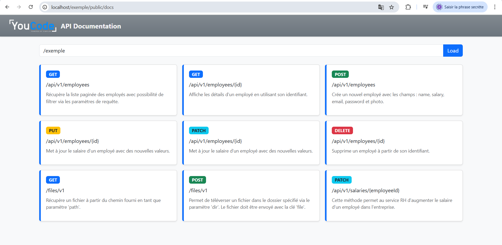

# Fil Rouge YouCode Année 1

#### Vu que nous sommes une ESN qui se spécialise dans la technologie PHP, nous avons opté pour la création d'un boilerplate permettant à nos futurs collaborateurs de développer des solutions digitales dans des domaines variés. En tant qu'apprenants, votre rôle est de comprendre cette architecture, respecter les conventions établies dans ce projet, et répondre aux besoins fonctionnels qui vous seront partagés.

## Objectif du Mini-Projet

Ce mini-projet vise principalement à évaluer les compétences en POO (programmation orientée objet) des apprenants.

### Étapes préliminaires

- Comprendre la structure du projet, notamment le cœur du système (core).

### Objectifs d'apprentissage

- Comprendre les bases de la programmation orientée objet.
- Appliquer le principe de couplage faible.
- Développer du code réutilisable.
- Comprendre et utiliser l'injection de dépendances.
- Utiliser le design pattern Singleton dans un contexte de serveur web.

### Prérequis

1. **Structure du projet**
   Les implémentations doivent se faire dans le répertoire `App/**`.

2. **Models**
   Contiennent les modèles de l'application (respecter l'encapsulation, implémenter `JsonSerializable` ou utiliser une couche `entities` qui l'implémente).

3. **Repositories**
   Vous serez amenés à manipuler les données comme un attribut de type `array`.  
   Votre classe `Repository` dans `App` doit étendre `RepositoryCache`.

   N'oubliez pas de redéclarer les méthodes `getData` et `setData`.  
   Même s'il n'y a pas de contrat formel, pensez à **mapper** vos données.

   N’oubliez pas d’appeler la méthode `commit` après chaque mutation.

   Voir l'exemple dans la classe `EmployeeRepository`.

4. **Services**
   Contient la logique métier, avec deux sous-dossiers : `Implementations` et `Interfaces`. Chaque service implémente son interface.

5. **Controllers**
   Doivent être placés dans `controllers/` et se terminer par `*Controller.php`. Ils doivent hériter de `Controller`.

### Routage

- **Convention RESTful** :

  - Implémenter `ResourceController` pour que les routes soient automatiquement enregistrées.

    | Méthode HTTP | Chemin              | Méthode Contrôleur |
    | ------------ | ------------------- | ------------------ |
    | GET          | /prefix/plural      | index              |
    | GET          | /prefix/plural/{id} | show               |
    | POST         | /prefix/plural      | store              |
    | PUT/PATCH    | /prefix/plural/{id} | update             |
    | DELETE       | /prefix/plural/{id} | destroy            |

- **Par annotation/attribut** :

  - Utilisez l'attribut `Route` pour spécifier le chemin, et pour chaque méthode, définissez le type HTTP et la sous-route (voir `SalaryController`).

- **Tester vos routes** :

  - Exemple : Projet dans `/www/example` → accéder via `localhost/example` ou `localhost/public/docs` pour une UI des endpoints.

  

# Installation

- Cloner le dépôt : `github.com/zziane/boilerplate-php-fy1-sql`
- Copier dans le serveur Apache (`wamp64` ou `xampp`) : `c:/wamp64/www/exemple` ou `c:/xampp/htdocs/exemple`
- Lancer `composer install` pour les dépendances (ex. `doctrine/inflector`)
- Initialiser la base via le script dans `database/`
- Adapter la datasource (`MysqlDataSource` ou `PostgreDataSource`)
- Tester l'application via les endpoints générés

# Documentation

## Contrôleur

- Étendre `Core\Controller`, qui expose `json()` pour réponse CORS-friendly, et dispose de l'objet `Request`.

## Classe `Request`

Gère l'accès aux parties d'une requête HTTP : corps, fichiers, headers, paramètres GET...

### Méthodes disponibles

- `__construct()` : initialise méthode HTTP, headers, fichiers, JSON body (si applicable).
- `input(string $key, $default = null)` : valeur POST/JSON
- `file(string $key): ?array` : infos fichier envoyé
- `hasFile(string $key): bool`
- `headers(): array`
- `all(): array`
- `param(?string $key = null): mixed`
- `getMethod()` : méthode HTTP utilisée
- `relativeUrl(): string` : URL relative (utile pour router)

# Classe RepositoryCache

La classe abstraite `RepositoryCache` fournit une gestion simple et sécurisée du cache des données pour les repositories.

---

## Description

`RepositoryCache` permet de stocker et récupérer des données sous forme de fichier cache chiffré sur le disque. Elle utilise le chiffrement symétrique AES-256-CBC pour sécuriser le contenu du cache.

Cette classe est conçue pour être étendue par des classes concrètes qui définissent comment les données sont obtenues (`getData`) et sauvegardées (`setData`).

---

## Fonctionnalités principales

- **Gestion du fichier cache**  
  Le fichier cache est stocké dans un dossier `.cache` situé à la racine du projet.  
  Son nom est dérivé du nom complet de la classe enfant (exemple : `App_Repositories_EmployeeRepository.cache`).

- **Chiffrement et déchiffrement**  
  Les données sont encodées en JSON, puis chiffrées avec une clé AES-256-CBC.  
  Un vecteur d'initialisation (IV) aléatoire est généré pour chaque chiffrement, garantissant la sécurité.  
  Le contenu est ensuite encodé en base64 pour être sauvegardé dans un fichier.

- **Chargement automatique**  
  Lors de la construction de l'objet, la méthode `load()` est appelée automatiquement.  
  Elle lit le fichier cache, déchiffre et décode les données, puis les injecte dans la classe via `setData`.

- **Sauvegarde des données**  
  La méthode `commit()` permet de sauvegarder les données actuelles (retournées par `getData()`) dans le fichier cache, en les chiffrant.

- **Effacement du cache**  
  La méthode `clear()` supprime le fichier cache.

---

## Méthodes abstraites à implémenter

Les classes filles doivent obligatoirement implémenter :

- `protected function getData(): array`  
  Retourne les données actuelles à cacher.

- `protected function setData(array $data): void`  
  Injecte les données lues depuis le cache dans la classe.

---

## Exemple d'utilisation

Une classe `EmployeeRepository` qui étend `RepositoryCache` devra gérer un tableau d'employés en cache. Elle devra définir `getData` et `setData` pour manipuler ce tableau, et appeler `commit()` après chaque modification pour mettre à jour le cache chiffré.

---

### Exemple d'utilisation

```php
class EmployeeRepository extends RepositoryCache
{

   private array $employees = [];

   public function findAllEmployees(): array
   {
        return array_values($this->employees);
   }

   public function deleteEmployee($id): bool
   {
        if (!isset($this->employees[$id])) {
            return false;
        }

        unset($this->employees[$id]);
        $this->commit();

        return true;
   }

   protected function getData(): array {
        return $this->employees;
    }

   protected function setData(array $data): void {
        $this->employees = $data;
   }
}
```

# Architecture

Le système est basé sur le principe **MVC2**, avec un **router dispatcher** qui analyse les URLs et appelle dynamiquement la méthode du contrôleur correspondante (comme un dispatcher servlet).

# Pour tester sur Postman

[Collection Postman](https://www.postman.com/simplon-devs/youcode-fil-rouge-a1/collection/9x2u8lq/youcode-fil-rouge-rattrapage)

# Recommandations

- Respecter la structure `App/`
- Trouver du plaisir dans la réalisation 😉
- **Bon courage !!**
